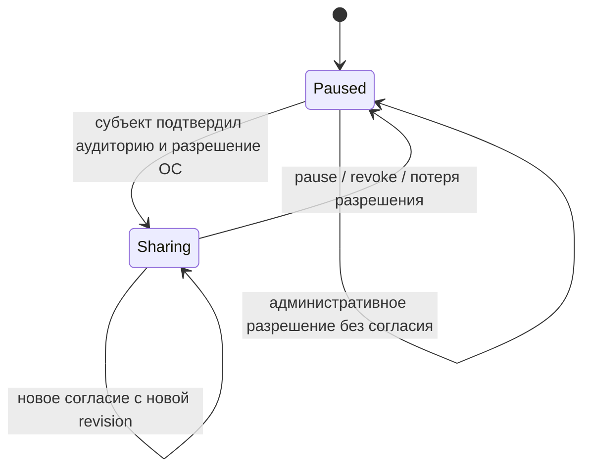
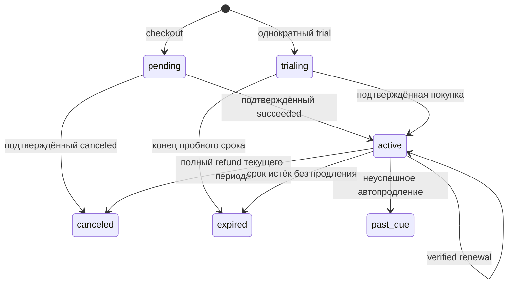

# ADR: состояния согласия, геолокации, оплаты и временного доступа

Статус: модель текущей реализации; внешние интеграции отмечены явно.

## Согласие и передача

Передача требует разрешённого собственного устройства и актуальной revision. Сервер запрещает подмену устройства, старую версию согласия и точки до начала разрешённого интервала. Отзыв закрывает REST и очередь доставки; outbox содержит непрозрачные идентификаторы, а получатели определяются заново при обработке. Направленная административная видимость и согласие — независимые проверки.

Location Engine выбирает состояние в порядке: нет разрешения/пауза → stop; иначе SOS → sport → live → normal → idle. Настройка сервера не отменяет системное разрешение или локальную паузу. Интервалы являются целью; гарантия периодичности в фоне невозможна без приёмки на телефонах. Батч/точка получают стабильные UUID. ACK accepted/duplicate удаляет соответствующую запись очереди; permanently_rejected завершает повтор этой точки; временный сбой сохраняет очередь.

## Оплата

`cancel_at_period_end`/`auto_renew` — отдельные флаги, не преждевременное завершение оплаченного доступа. Тарифная цена зафиксирована через plan_price_id. Плановая задача создаёт одну попытку списания на период со стабильным provider idempotency key; права продлеваются только по verified settlement. Включение автопродления требует явного выбора и подтверждённого сохранённого способа оплаты. Sandbox недоступен в production. YooKassa сверяется через authenticated provider API; pending оплаты периодически сверяются для восстановления пропущенных callbacks. Автоматический dunning, grace, store verification и refund initiation пока не закрыты.

Входящее событие нормализуется и проверяется; inbox, платёж, invoice, entitlement, комиссия, audit и outbox фиксируются одной транзакцией. Дубликат события не повторяет эффект. Поздний canceled/succeeded не откатывает финальное состояние платежа. Refund, пришедший до settlement, возвращает конфликт для повтора. Возврат старого периода не отменяет более новый оплаченный период. Состояния grace/paused есть в схеме, но не обещаются как работающий провайдерный процесс.

## Промокоды и партнёры

Промокод предоставляет один benefit: free_access, discount либо free_months. Redemption и лимит расходуются атомарно и идемпотентно. Discount резервирует один цикл и бюджет при checkout; закрытие заброшенных checkout и возврат такого резерва требуют отдельной политики. Free_months продлевает активную подписку. Бесплатный доступ не начисляет партнёру комиссию.

Комиссия: held → payable → reserved → paid; refund добавляет reversal, включая отрицательный баланс после выплаты. Правила и расчёт сохраняются снимком. Частичные возвраты округляются накопительным методом, поэтому полный refund сторнирует точную исходную комиссию. Партнёр запрашивает весь доступный баланс выше минимума; ручное подтверждение фиксирует уже исполненную выплату и требует права/причины, а MFA проверяет административный интерфейс. Изменённый возвратом баланс блокирует подтверждение до сверки.

## Live, SOS и временная ссылка

Live: requested → active после личного confirmed; далее ended/expired. Отправитель может завершить сессию; нельзя удалённо обойти паузу. SOS: active → ended, подтверждения получателей хранятся отдельно и не означают прибытие помощи.

Временная ссылка: active → revoked/expired; короткая capability проверяет исходное согласие при каждом чтении. Веб-клиент: ready → opening → active; offline сохраняет явно помеченную последнюю позицию только до истечения capability; unavailable/expired удаляет позицию и токен, отменяет запросы и таймер. Поздний ответ предыдущего поколения не может вернуть координаты на экран.
