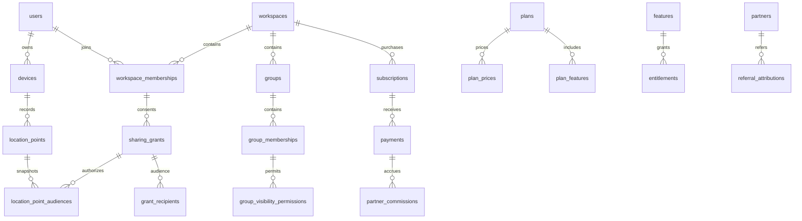

# База данных KIRH GEO

`schema.sql` — исходная исполняемая схема для **пустой** PostgreSQL 16+ с PostGIS 3.x. Она не является идемпотентной миграцией: повторный запуск намеренно завершается ошибкой, а транзакция исключает частичное создание. Laravel migration runner должен учитывать свою существующую `users` и не создавать её дважды. Последующие изменения оформляются отдельными миграциями; production не пересоздаётся этим файлом.

```sh
psql "$DATABASE_URL" -v ON_ERROR_STOP=1 -f docs/database/schema.sql
```

Исполнять ролью миграций. Runtime-роль не должна владеть таблицами, создавать расширения или отключать триггеры. Все UUID создаются сервером либо проверяются как клиентские идемпотентные идентификаторы; instants — `timestamptz`, соединение — UTC. Денежные суммы — целые минимальные единицы, валюта хранится рядом. `updated_at` обновляет приложение.

## Основные отношения



## Словарь модулей

| Область | Таблицы и смысл |
|---|---|
| Identity | `users`, `devices`, `auth_sessions`: самостоятельная identity приглашённого, device ownership, refresh families и ротация |
| Tenancy | `workspaces`, `workspace_memberships`, `groups`, `group_memberships`, `invitations`: scoped membership, одноразовый код |
| Access | `roles`, `permissions`, `role_permissions`, три вида role assignments, `group_visibility_permissions`: управление разрешениями без предоставления согласия |
| Consent | `consent_logs`, `sharing_grants`, `grant_recipients`, `location_preferences`: явная неизменяемая аудитория и пауза |
| Catalog | `plans`, `features`, `plan_features`, `plan_prices`: версии, типизированные права и месячные/годовые цены |
| Billing | `subscriptions`, `payments`, `invoices`, `invoice_items`, `refunds`, `payment_webhook_events`: состояния, сверка, inbox |
| Promotions | `promo_codes`, `promo_benefits`, `promo_redemptions`, `promotion_applications`, `billing_credits`, `trials`: бесплатный доступ, скидки и месяцы |
| Entitlements | `entitlements`, `usage_counters`, `usage_events`, `usage_reservations`: разрешения и атомарные квоты через сервис |
| Partners | `partners`, `partner_programs`, `partner_program_versions`, `referral_links`, `referral_codes`, `referral_attributions`, `partner_commissions`, `partner_ledger_entries`, `partner_payouts`, `partner_payout_items` |
| Location | `location_batches`, `location_point_receipts`, `location_points`, `location_point_audiences`: дедупликация, партиционированная история, отдельные основания доступа |
| Geofencing | `geofences`, `geofence_targets`, `geofence_states`, `geofence_events`: круг, субъект, последовательность перехода |
| Safety/sharing | `sos_events`, `sos_acknowledgements`, `live_sessions`, `live_session_participants`, `temporary_shares` |
| Activity | `activity_sessions`, `activity_laps`, `activity_metric_samples`: задел sport; расчёт спортивной аналитики не реализуется |
| Delivery | `notifications`, `notification_deliveries`, `notification_preferences`, `device_tokens`, `outbox_events`, `consumer_receipts` |
| Operations/privacy | `application_settings`, `audit_logs`, `system_events`, `export_requests`, `deletion_requests`, `deletion_tombstones` |

`current_locations` — **Redis-проекция**, SQL-таблица отсутствует намеренно. Ключ scoped по workspace/user/device, значение содержит point ID, captured/received timestamps, позицию, accuracy, battery и consent revision. CurrentLocationStore проверяет доступ заново, обновляет CAS только более новой точкой, применяет TTL и восстанавливает проекцию из разрешённой истории. Геоданные запрещены в обычных логах, push-пayload и публичных workspace broadcast channels.

## Взаимная видимость

Администратор группы может создать разрешённое направление `subject → viewer` в `group_visibility_permissions`. Каждое направление независимо: разрешение A видеть B не даёт B права видеть A. `mutual_tracking_enabled` — переключатель разрешённого режима группы, не согласие участников.

Получатель должен одновременно иметь active account/device, действующее членство, permission, разрешённое направление группы, feature entitlement, запись в `grant_recipients` и действующий grant самого субъекта. Владелец передаёт свои координаты на тех же условиях. `is_platform_admin` открывает административную панель, но не геоданные.

Grant ссылается на self-authored `consent_logs` (БД проверяет actor = subject), его workspace и subject сверяет application service. Новая аудитория создаёт новый grant/версию; нельзя дописывать получателей старого grant и раскрывать старую историю. Отзыв/пауза блокируют чтение немедленно независимо от cron/cache. На чтении истории также проверяются capture-time audience, текущее членство, consent scope, сроки и доступный retention. После выхода старое членство сохраняется как запись для аудита, но не даёт доступа; повторное вступление требует новой версии согласия.

## Частота и глубина истории в админке

Контракт `application_settings(namespace,key,value,version,updated_by)` хранит только зарегистрированные сервером настройки. Предлагаемые ключи:

| namespace / key | Значение JSON | Первоначальный ориентир |
|---|---|---|
| `location / policy` | полный объект `config/location.php`, `modes.{mode}.capture_seconds/upload_seconds` | idle 600/600; normal 60/60; live 5/5; sport 3/15; sos 3/3 |
| поля policy | `batch_max_points`, `batch_max_bytes`, `offline_max_hours`, `future_tolerance_seconds` | 500, 524288, 72, 120 |
| поля policy | `history_default_days`, `history_max_days`, `current_ttl_seconds` | 7, 90, 86400; TTL не даёт доступа при revoked/paused |
| `billing / default_plan_id` | UUID опубликованной версии каталога | начальная выдача прав создаваемому workspace |

Админский form и API обязаны проверять диапазоны/типы, сохранять audit reason, инкрементировать version. Это целевые интервалы: ОС и батарея могут снизить фактическую частоту. Эффективная глубина = минимум системного максимума, entitlement `history.retention_days` и пользовательского выбора. Увеличение лимита не воскрешает данные; сокращение немедленно ограничивает выдачу, worker очищает истёкшие аудитории и затем точки без оснований хранения. Sport требует отдельного законного основания; сама пустая `activity_sessions` не продлевает хранение GPS.

## Транзакционные границы

- GPS: device-auth + согласия → INSERT batch/receipts/points/audiences/outbox → сохранённый response. Повторный batch ID с другим payload hash — 409. Уникальность receipts действует между партициями. Receipt хранится дольше окна повторной загрузки; старые captured_at вне окна отклоняются независимо от наличия receipt.
- Квота: блокировка workspace/counter → проверка → резерв/создание/usage в одной транзакции. `consumed + reserved <= limit` проверяет сервис под блокировкой: limit вычисляется из версионированных прав и не может быть обычным CHECK.
- Webhook: адаптер подтверждает событие, записывает inbox с уникальным `(provider,external_event_id)`, затем worker под блокировкой subscription меняет оплату/права/outbox. Нормализованный payload хранится шифрованным. Старое событие не откатывает новое.
- Promo: блокируются код и workspace, проверяются eligibility, повторные применения, budget, provider capabilities; redemption и benefit применяются атомарно. JSON `eligibility`/snapshot не заменяют серверные обработчики.
- Partner: подтверждённый payment → immutable commission snapshot + ledger, уникальный business key предотвращает дубли. Refund создаёт reversal. Единственное включение commission в payout запрещено unique constraint; failed payout повторяется с тем же ID, не создаётся новая выплата на те же items. Сверка сумм, валют и принадлежности payment/attribution выполняется сервисом в транзакции.

## Партиции и удаление

DDL создаёт месяцы UTC от предыдущего до двух будущих; отдельный scheduler должен заранее создавать следующие партиции. Без нужной партиции INSERT безопасно отклоняется. Default partition намеренно отсутствует: сбой обслуживания становится видимым.

`location_point_audiences` ссылается на составной PK истории. Для row deletion используется cascade. Для удаления/отсоединения целой партиции сначала удаляются истёкшие audience rows и проверяется отсутствие легитимных оснований; сам FK может мешать DROP/DETACH, поэтому это отдельная протестированная maintenance-процедура, а не произвольный `DROP CASCADE`. История и receipts имеют разные retention. Геособытия сохраняют opaque point ID без FK, чтобы не блокировать очистку координат.

`consent_logs`, `audit_logs`, `partner_ledger_entries` защищены от UPDATE/DELETE триггером. Правомерное удаление персональных данных выполняется отдельной maintenance-ролью с контролируемыми исключениями и tombstones; FK намеренно не делает широких каскадов для identity/финансовых записей. Политика сроков финансового и доказательного хранения должна быть утверждена до production.

## Проверка перед production

Схема требует интеграционного прогона на реальных PostgreSQL/PostGIS: миграция в пустую БД, cross-tenant FK violations, конкурирующий GPS/payment/promo retry, роли runtime/migration, ST_DWithin в метрах, партиции, retention и восстановление резервной копии. Наличие DDL не подтверждает прохождение этих проверок.
